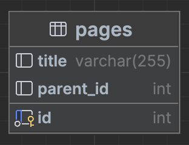
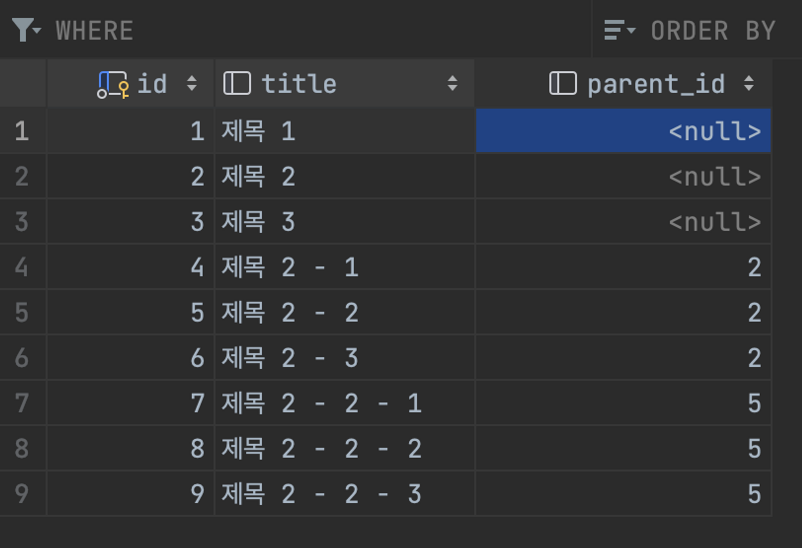
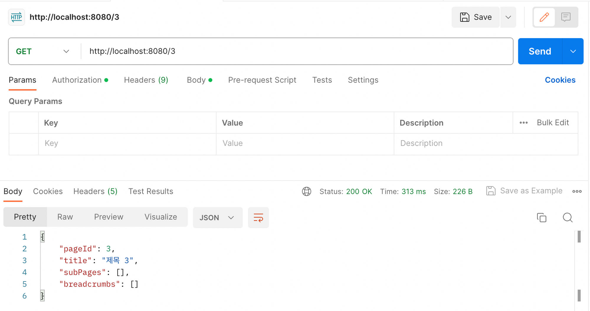
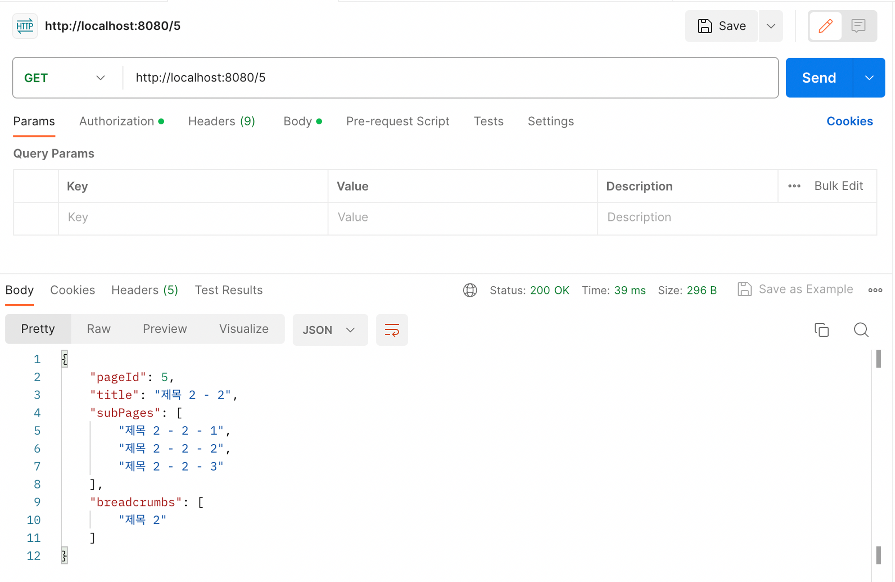
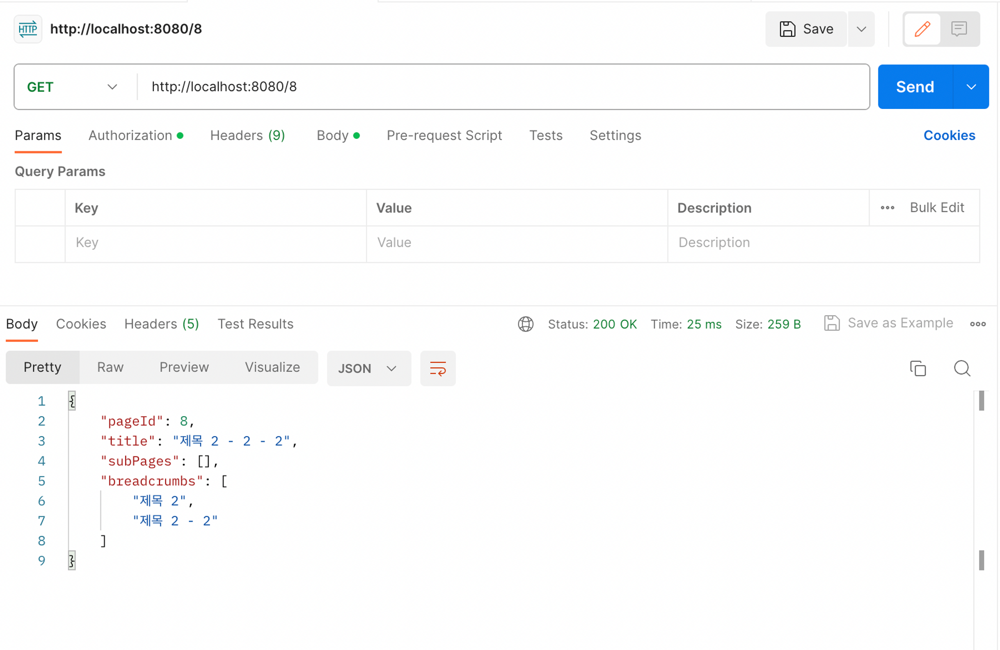

# Notion_Breadcrumbs
원티드 팀 과제 - 노션에서 브레드크럼즈(Breadcrumbs) 만들기

- **테이블 구조**

  
    
- 비지니스 로직 (Raw 쿼리로 구현 → ORM (X))
    
    ```java
    	@Transactional
        public PageInfo findPost(Long pageId) {
            List<String> breadcrumbs = new ArrayList<>();
    
            String sql = "SELECT *  FROM pages where id = ?";
            Page foundPage = jdbcTemplate.queryForObject(sql, (rs, rowNum) -> {
                Page page = new Page();
                page.setId(pageId);
                page.setTitle(rs.getString("title"));
                page.setParentId(rs.getLong("parent_id"));
                return page;
            }, pageId);
            // id, title, parentId 설정
    
            sql = "SELECT title FROM pages WHERE parent_id = ?";
            List<String> subPages = jdbcTemplate.queryForList(sql, String.class, pageId);
    
            Long parentId = foundPage.getParentId();
    
            while (parentId != 0) {
                sql = "SELECT title, parent_id FROM pages where id = ?";
    
                Page found = jdbcTemplate.queryForObject(sql, (rs, rowNum) -> {
                    Page page = new Page();
                    page.setTitle(rs.getString("title"));
                    page.setParentId(rs.getLong("parent_id"));
                    return page;
                }, parentId);
                breadcrumbs.add(0, found.getTitle());
                parentId = found.getParentId();
            }
            return PageInfo.builder()
                    .pageId(foundPage.getId())
                    .title(foundPage.getTitle())
                    .subPages(Collections.unmodifiableList(subPages))
                    .breadcrumbs(Collections.unmodifiableList(breadcrumbs))
                    .build();
        }
    ```
    
- 결과  정보

  

  

  

  
    
    ```java
    {
    		"pageId" : 1,
    		"title" : 1,
    		"subPages" : [],
    		"breadcrumbs" : ["A", "B", "C",] // 혹은 "breadcrumbs" : "A / B / C"
    }
    ```
    
- 제출하신 과제에 대해서 설명해주세요.
    - ORM을 사용하지 않고 Raw 쿼리로 구성하여 데이터베이스에서 데이터를 빼오고 객체를 따로 생성해주었는데, 순수 JDBC를 이용해 Connection을 생성해 구성해볼까도 생각해 보았지만 JDBC Template을 활용해 보다 쉽게 DB와 커넥션을 맺을 수 있었다
    - page를 저장할 때 parentId를 같이 저장하여 subPages와 breadcrumbs를 찾을 때 보다 간단하게 찾을 수 있다
    
- ## 구성

    ### 프로젝트 초기 설정
    
    spring version : 2.7.15
    
    java 11
    
    dependency : JDBC API, MySqlDriver, Validation, Lombok, Spring Web
    
    ### Controller
    
    `create()` : "/create"에 접근시 `save()` 메서드를 호출해서 미리 구성한 파일들이 저장된다
    
    depth는 아래와 같다
    
    ```java
    제목1
    제목2
    	제목 2-1
    	제목 2-2
    		제목 2-2-1
    		제목 2-2-2
    		제목 2-2-3
    	제목 2-3
    제목3
    ```
    
    `search()` : `findPost()`를 호출해 PageInfo를 받아 반환한다
    
    ### Service
    
    `save()`메서드로 미리 page depth와 구조를 구성
    
    `findPost()` :
    
    1. DB에서 인자로 전달된 postId를 갖는 row의 데이터로 Page객체를 구성한다
    
    2. 해당 Page 객체의 id를 parentId로 갖는 row들을 가져온다
    
    3. 해당 Page 객체의 parentId를 id로 갖는 row들을 가져온다
    
    4. PageInfo객체를 생성하여 반환한다
    
    ### DTO
    
    출력결과에 맞게 PageInfo DTO를 구성
    
    ### Entity
    
    DB에 저장되는 pages 테이블과 매핑되는 Page
    
    parentId 는 현재 페이지의 부모 페이지를 의미한다
    
    
  